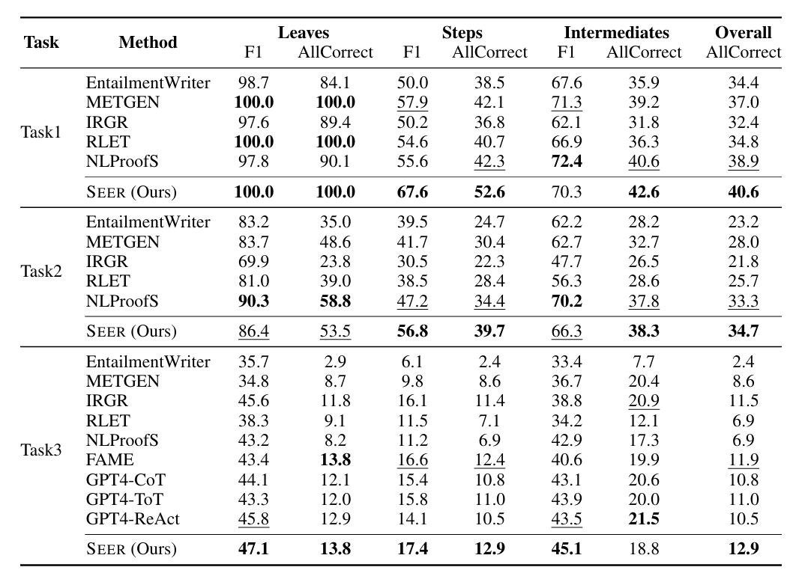
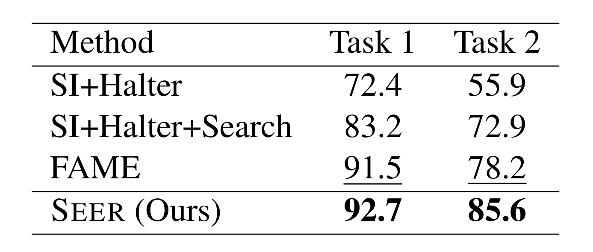
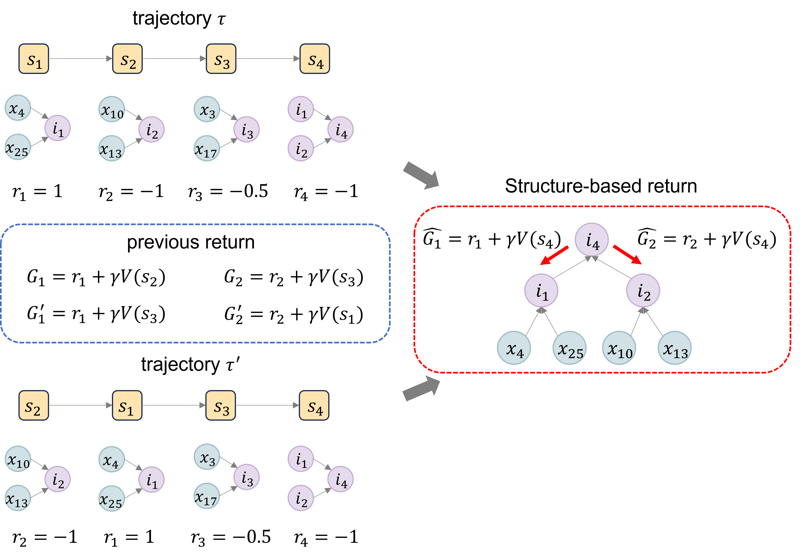

<p align="center">
   
</p>

# 📖SEER: Facilitating Structured Reasoning and Explanation via Reinforcement Learning (ACL 2024)

This repository contains the code for our research paper titled "[SEER: Facilitating Structured Reasoning and Explanation via Reinforcement Learning](https://arxiv.org/pdf/2401.13246)", which has been accepted the main conference for ACL 2024.


<a href='https://arxiv.org/abs/2401.13246'> </a>


## News 📢

[05/31/2024] **<a href="https://arxiv.org/abs/2401.13246.pdf"><b>Our Paper</b>👁️</a>, is accepted the main conference for ACL 2024**.


## TODO :pushpin:
- [ ] Release the Code and Data
<!-- - [x] -->


## Usage :paperclip:

We are excited to announce that both the code and data utilized in our study will be made publicly available in the near future.


## 1. An example of Structured Reasoning Task

<p align="center">
   
</p>


## 2. Method
### 🤗Overall framework of SEER

<p align="center">
   
</p>

> For trajectory rollout, action generation (Policy) and conclusion generation (entitlement) are performed alternately. The orange area details the reasoning process from st to st+1. For policy optimization, the reward module assigns rewards and updates the policy and critic based on tree or graph structures.


## 3. Experiments Results Analysis

### 🤗 Experiment results on EntailmentBank (Table 1). 

**Bold and underlined texts highlight the best method and the runner-up**. RLET is based on DeBERTa-large, while all other methods are based on T5-large. All baseline results come from published papers. We use the `GPT-4-1106-preview` version for GPT-4.

<p align="center">
   
</p>

<p align="center">
  <small>Table 1: Experiment results on EntailmentBank</small>


### 🤗 Experiment results on the EntailmentBankQA (Table 2).

<p align="center">
   
</p>

<p align="center">
  <small>Table 2: Experiment results on the EntailmentBankQA</small>

### 🤗 Experiment results on the STREET benchmark (Table 3).

<p align="center">
   
</p>

<p align="center">
  <small>Table 3: Experiment results on the STREET benchmark.</small>


## 4. Illustrations

### 🤗 Reward Process

<p align="center">
   
</p>


An illustration of the reward and alignment process of SEER. Each reasoning step represents a subtree.

(1) Tpred is constructed using the last intermediate conclusion (i4 in this example) as the hypothesis.

(2) The Jaccard similarity between the intermediate nodes (i∗) in Tpred and each golden intermediate node in Tgold (ˆi1 and h in this example) is calculated, and alignment is performed based on the maximum Jaccard similarity. In this example, i1 is aligned with ˆi1 because JS(i1,ˆi1) = 1. i2 is aligned with "NULL". i4 is aligned with ˆi1 because JS(i4,ˆi1) = 0.5 and JS(i4, h) = 0.4.

(3) Rewards are assigned based on the alignment results. Note that i3 (s3) is a redundant step. r1 = 1, r2 = -1, r3 = -0.5, and r4 = -1. The reward for each state originates from the tree structure rather than the chained trajectory. Therefore, the return of each state should also follow the tree structure (or graph structure in reasoning graphs) rather than the chained trajectory.


### Equivalent trajectory and Structure-based Return. 


<p align="center">
   
</p>


An illustration of the equivalent trajectory and the definition of return. As the reasoning steps of $s_1$, $s_2$, and $s_3$ are mutually independent, the execution order among these steps can be arbitrary. Thus, $\tau$ and $\tau^{\prime}$ are equivalent trajectories because they can be converted to the same entailment tree. As shown in <font color=blue>blue box</font>, previous work defines the return (a.k.a cumulative reward) in a chained trajectory and would assign different returns to $s_1$ and $s_2$ in these equivalent trajectories. In contrast, as shown in <font color=red>red box</font>, our structure-based return is defined based on the tree or graph structure inherent in structured reasoning, which is the same source of rewards. Our structure-based return will consistently allocate stable returns to equivalent trajectories, thereby promoting training stability and convergence. Furthermore, maintaining consistency between the sources of rewards and returns can significantly enhance the effectiveness of the policy.


## 6. Citation

If our paper is helpful in your projects, please cite our paper and help to ⭐ this repo. Thanks.

```
@article{Chen2024SEERFS,
  title={SEER: Facilitating Structured Reasoning and Explanation via Reinforcement Learning},
  author={Guoxin Chen and Kexin Tang and Chao Yang and Fuying Ye and Yu Qiao and Yiming Qian},
  journal={ArXiv},
  year={2024},
  volume={abs/2401.13246},
  url={https://api.semanticscholar.org/CorpusID:267199832}
}

```

## 7. Contact

If you have any questions, please raise an issue or contact us at 📧 Email: gx.chen.chn@gmail.com